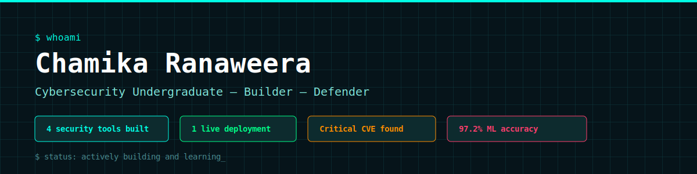
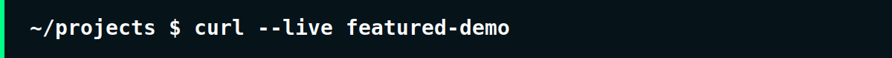
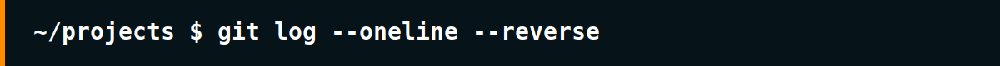
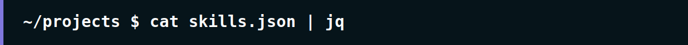
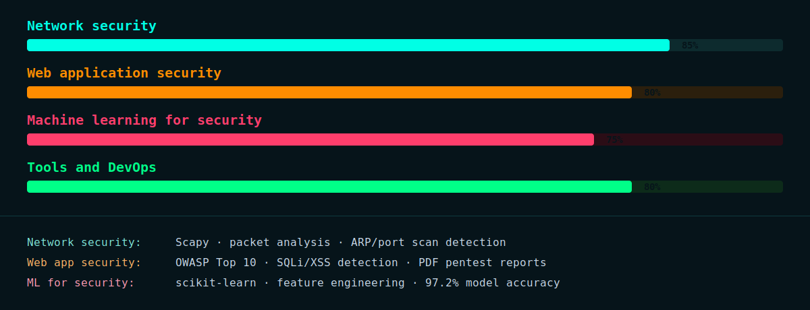

<div align="center">



<br><br>

<a href="https://tryhackme.com/p/seasonsofyjinn"></a>
<a href="https://cve-dashboard-pup2.onrender.com"></a>
<a href="https://github.com/chamika-r"></a>

</div>

<br>

## About me

```python
class Chamika:
    def __init__(self):
        self.role = "Undergraduate cybersecurity student"
        self.focus = ["Network security", "Web app security", "Threat intelligence"]
        self.philosophy = "Don't just study attacks — build the tools that detect them"
        self.location = "Sri Lanka"

    def current_goals(self):
        return [
            "Land a cybersecurity internship",
            "Contribute to real security teams",
            "Keep building, keep breaking, keep learning",
        ]
```

<br>



<br>

<div align="center">

### CVE intelligence dashboard
A real-time vulnerability intelligence platform pulling live data from the
NIST National Vulnerability Database

<a href="https://cve-dashboard-pup2.onrender.com">

</a>

<sub>Free hosting — first load may take ~30 seconds to wake up</sub>

`Python` `Flask` `SQLite` `Chart.js` `Render`

</div>

<br>


<br>

<table>
<tr>
<td width="50%" valign="top">

### Phishing email detector

ML-powered phishing detection trained on 5,172 real emails


Flask REST API returns predictions with confidence scores and
plain-English explanations of suspicious indicators.

<kbd>Python</kbd> <kbd>scikit-learn</kbd> <kbd>Flask</kbd> <kbd>pandas</kbd>

[View project →](https://github.com/chamika-r/phishing-detector)

</td>
<td width="50%" valign="top">

### Network packet analyzer

Real-time traffic analyzer detecting port scans and ARP spoofing
as they happen


Live terminal dashboard built with Rich — captures, analyzes,
and alerts on suspicious network activity.

<kbd>Python</kbd> <kbd>Scapy</kbd> <kbd>Rich</kbd>

[View project →](https://github.com/chamika-r/network-analyzer)

</td>
</tr>
<tr>
<td width="50%" valign="top">

### Web vulnerability scanner

OWASP Top 10 scanner — found 9 real vulnerabilities on DVWA


Generates professional PDF penetration test reports with
severity ratings and remediation guidance.

<kbd>Python</kbd> <kbd>BeautifulSoup</kbd> <kbd>Click</kbd> <kbd>ReportLab</kbd>

[View project →](https://github.com/chamika-r/web-vulnerability-scanner)

</td>
<td width="50%" valign="top">

### Security writeups

Documenting hands-on learning through CTF challenges
and TryHackMe rooms


Each writeup breaks down the attack, exploitation steps,
and lessons learned in detail.

<kbd>CTF</kbd> <kbd>TryHackMe</kbd> <kbd>Writeups</kbd>

[View repo →](https://github.com/chamika-r/security-writeups)

</td>
</tr>
</table>

<br>



<br>

<table>
<tr>
<td width="120" align="center"><b>Step 1</b></td>
<td>

**Built an ML phishing detector**
Trained a logistic regression model on 5,172 real emails — achieved 97.20% accuracy.
Wrapped it in a Flask API with confidence scores and explanations.

</td>
</tr>
<tr>
<td align="center"><b>Step 2</b></td>
<td>

**Built a live network analyzer**
Captured real packets with Scapy. Built detectors for port scanning and ARP spoofing,
displayed in a live terminal dashboard updating every 0.5 seconds.

</td>
</tr>
<tr>
<td align="center"><b>Step 3</b></td>
<td>

**Built a vulnerability scanner**
Wrote a scanner that tests for OWASP Top 10 vulnerabilities. Ran it against DVWA and
found 9 real vulnerabilities, including a critical SQL injection — then generated a
professional PDF pentest report.

</td>
</tr>
<tr>
<td align="center"><b>Step 4</b></td>
<td>

**Deployed a live CVE dashboard**
Built and deployed a real-time dashboard pulling live data from the NIST NVD.
Currently live — showing real vulnerabilities published within the last 24 hours.

</td>
</tr>
<tr>
<td align="center"><b>Next</b></td>
<td>

**Cybersecurity internship**
Looking to bring this hands-on, build-first mindset to a real security team.

</td>
</tr>
</table>

<br>



<br>



<br>

<div align="center">


</div>

<br>

| Domain | Tools and concepts |
|:---|:---|
| Security | Scapy · OWASP Top 10 · Nmap · DVWA · MITRE ATT&CK · Cyber Kill Chain |
| ML / data | scikit-learn · pandas · numpy · logistic regression |
| Web | Flask · BeautifulSoup · requests · Chart.js · REST APIs |
| DevOps | Git · Docker · Render · virtual environments |

<br>

---

<br>

## GitHub stats

<div align="center">


</div>

<br>

---

<br>

<div align="center">

**Currently:** expanding security-writeups with CTF solutions · learning advanced threat hunting
**Goal:** cybersecurity internship 2026
**Ask me about:** ML for security, network analysis, web app pentesting

<br>

<a href="https://tryhackme.com/p/seasonsofyjinn">

</a>

<br><br>

*"Security is not a product, it's a process."* — Bruce Schneier

<br>


</div>
